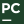

<!-- programming language -->

  
  &nbsp;&nbsp;
  

<!-- frameworks & libraries -->

  
  &nbsp;&nbsp;
  
  &nbsp;&nbsp;
  
  &nbsp;&nbsp;
  

<!-- tools -->

  
  &nbsp;&nbsp;
  
  &nbsp;&nbsp;
  
  &nbsp;&nbsp;
  

